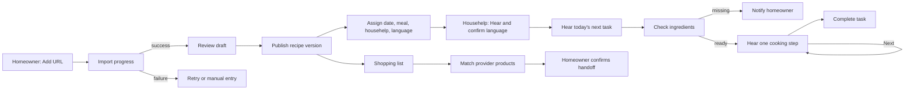

# Low-Fidelity Wireframes

Status: concept wireframes for scope review. These define hierarchy and workflow, not visual styling.

Legend: `[ Primary ]` action, `( )` option, `[x]` selected/check, `▣` verified visual, `!` warning, `?` help.

## Homeowner — H1 Today dashboard

```text
┌──────────────────────────────────────────┐
│ Home                    Household ▾  🔔  │
│ Good morning, Asha                       │
│ [ + Add recipe ]                         │
├──────────────────────────────────────────┤
│ TODAY                                    │
│ Lunch · 1:00 PM                          │
│ ┌──────────────────────────────────────┐ │
│ │ Paneer Butter Masala        Assigned │ │
│ │ Rani · 4 servings           Not begun│ │
│ │ [View] [Message / issue]              │ │
│ └──────────────────────────────────────┘ │
│                                          │
│ ! 2 ingredients still needed  [Review]  │
├──────────────────────────────────────────┤
│ IMPORTS                                  │
│ Masala Dosa video · Needs review  [Open] │
├──────────────────────────────────────────┤
│ Today   Recipes   Add   Shopping   More  │
└──────────────────────────────────────────┘
```

## Homeowner — H2 Add recipe

```text
┌──────────────────────────────────────────┐
│ ← Add a recipe                           │
│ Paste a public recipe or YouTube link    │
│                                          │
│ Recipe URL                               │
│ ┌──────────────────────────────────────┐ │
│ │ https://...                          │ │
│ └──────────────────────────────────────┘ │
│ We will extract ingredients and steps.   │
│ You will review them before anyone cooks.│
│                                          │
│ [ Import recipe ]                        │
│                                          │
│ Supported: public webpages and YouTube   │
│ ? Why might a link not work?             │
└──────────────────────────────────────────┘
```

## Homeowner — H3 Import progress

```text
┌──────────────────────────────────────────┐
│ Preparing your recipe                    │
│ "Masala Dosa Recipe"                    │
│                                          │
│ [✓] Link checked                         │
│ [✓] Transcript found · English           │
│ [●] Finding ingredients and steps        │
│ [ ] Ready for your review                 │
│                                          │
│ This usually takes a few minutes.         │
│ You can leave this screen.                │
│                                          │
│ [ Go to Today ]             [ Cancel ]   │
└──────────────────────────────────────────┘
```

Failure variant:

```text
┌──────────────────────────────────────────┐
│ ! We could not find a transcript         │
│ This video does not provide usable       │
│ captions. We did not create guessed steps│
│                                          │
│ [ Try again ]  [ Enter recipe manually ] │
│ [ Open original video ]                  │
└──────────────────────────────────────────┘
```

## Homeowner — H4 Review recipe (wide layout)

```text
┌──────────────────────────────────────────────────────────────────────┐
│ ← Draft recipe     ! 3 items need attention      [Save] [Publish]  │
├──────────────────────────────┬───────────────────────────────────────┤
│ SOURCE                       │ RECIPE                                │
│ YouTube · Cook With Me       │ Title [Paneer Butter Masala_______]  │
│ [Open source ↗]              │ Servings [4]  Prep [20m] Cook [30m] │
│ 03:14 "add about a spoon..." │                                       │
│                              │ INGREDIENTS                           │
│ Review filters               │ 1. Paneer [500] [g]                  │
│ (●) Needs attention 3        │ 2. Butter [2] [tbsp]                 │
│ ( ) All fields               │ 3. Cream [ ? ] [ ? ]  ! Missing qty │
│                              │ [+ Ingredient]                       │
│                              │                                       │
│                              │ STEPS                                 │
│                              │ 1 Short: Brown the paneer            │
│                              │   Detail: Heat... [03:14 ↗] [Edit]   │
│                              │ 2 Short: Make the gravy       ! Time │
│                              │ [+ Step]                              │
└──────────────────────────────┴───────────────────────────────────────┘
```

## Homeowner — H5 Recipe detail and H6 Assign

```text
┌──────────────────────────────────────────┐
│ ← Recipes                         ⋯      │
│ Paneer Butter Masala                    │
│ Reviewed · Source: Cook With Me ↗       │
│ 4 servings · 20m prep · 30m cook        │
│                                          │
│ [ Assign to cook ]  [ Add to shopping ] │
│                                          │
│ Ingredients (12)             [View all] │
│ Steps (8)                    [Start view]│
└──────────────────────────────────────────┘

┌──────────────────────────────────────────┐
│ ← Assign Paneer Butter Masala            │
│ Date       [ Tomorrow ▾ ]                │
│ Meal       [ Dinner ▾ ]  Time [7:30 PM] │
│ Assignee   [ Rani ▾ ]                    │
│ Servings   [ − ] 4 [ + ]                 │
│ Notes      [Use less chilli___________] │
│                                          │
│ [ Assign recipe ]                        │
└──────────────────────────────────────────┘
```

## Homeowner — H7 Shopping list

```text
┌──────────────────────────────────────────┐
│ ← Shopping for tomorrow                  │
│ From 2 planned recipes                   │
│                                          │
│ NEEDED (6)                               │
│ [x] Paneer · 500 g                       │
│ [x] Tomatoes · 6                         │
│ [x] Fresh cream · 200 ml                 │
│ [ ] Garam masala · 1 tsp   [At home]     │
│                                          │
│ OPTIONAL (2)                             │
│ [ ] Coriander · 1 bunch                  │
│                                          │
│ [+ Add item]                             │
│ [ Find products for 3 items ]            │
└──────────────────────────────────────────┘
```

## Homeowner — H8 Provider match and handoff

```text
┌──────────────────────────────────────────┐
│ ← Review products                        │
│ Provider: Grocery partner ▾              │
│                                          │
│ Paneer · need 500 g                      │
│ [x] Brand A Paneer · 2 × 250 g · ₹___   │
│     In stock                  [Change]    │
│                                          │
│ Fresh cream · need 200 ml                │
│ ! No exact match             [Choose]    │
│                                          │
│ Estimated items: 2 · Total: ₹___         │
│ Prices and availability can change.      │
│                                          │
│ [ Continue to provider ]                 │
│ You will review and pay with the provider│
└──────────────────────────────────────────┘
```

## Househelp — HH0 Spoken-language setup

The first screen has one obvious action so speech can begin after the user's first tap. It contains no reading-dependent choice.

```text
┌──────────────────────────────────────────┐
│                                          │
│                                          │
│                                          │
│                  🔊                      │
│                                          │
│        ┌──────────────────────┐          │
│        │      TAP / PRESS     │          │
│        └──────────────────────┘          │
│                                          │
│                                          │
└──────────────────────────────────────────┘
```

The tap says: “Sound is on. Choose your language. Tap a button to hear it.” The homeowner may preselect a likely language, but the househelp confirms it on the next state.

```text
┌──────────────────────────────────────────┐
│                         🔊               │
│                                          │
│             🌐                           │
│                                          │
│  ┌────────────────────────────────────┐  │
│  │ 🔊  हिन्दी                        │  │
│  └────────────────────────────────────┘  │
│                                          │
│  ┌────────────────────────────────────┐  │
│  │ 🔊  मराठी                         │  │
│  └────────────────────────────────────┘  │
│                                          │
│  ┌────────────────────────────────────┐  │
│  │ 🔊  English                       │  │
│  └────────────────────────────────────┘  │
│                                          │
│  [ ✓ Continue in selected language ]     │
└──────────────────────────────────────────┘
```

Tap response: each option speaks its own language name. Selection says, for example, “Hindi selected. Press the large button below to continue.”

## Househelp — HH1 Today

Only the next task is prominent. On entry, the app says: “Today. Next, make paneer butter masala for lunch. Press Start.”

```text
┌──────────────────────────────────────────┐
│  🌐 हिन्दी                    🔊 Repeat │
│                                          │
│                 1:00                     │
│                                          │
│        ┌────────────────────────┐        │
│        │ ▣ verified dish photo  │        │
│        └────────────────────────┘        │
│                                          │
│        Paneer Butter Masala              │
│             4 people                     │
│                                          │
│  ┌────────────────────────────────────┐  │
│  │             ▶ START               │  │
│  └────────────────────────────────────┘  │
│                                          │
│                 ? Help                   │
└──────────────────────────────────────────┘
```

Tap response: “Start. Paneer butter masala. First, check the ingredients.”

## Househelp — HH2 Task briefing

The briefing is spoken automatically. Text is kept only as a short visual confirmation.

```text
┌──────────────────────────────────────────┐
│  🌐 हिन्दी                    🔊 Repeat │
│                                          │
│        ┌────────────────────────┐        │
│        │ ▣ verified dish photo  │        │
│        └────────────────────────┘        │
│                                          │
│        Paneer Butter Masala              │
│                                          │
│        4 people       1:00               │
│                                          │
│        Less chilli                       │
│                                          │
│  ┌────────────────────────────────────┐  │
│  │        🥕 CHECK INGREDIENTS        │  │
│  └────────────────────────────────────┘  │
│                                          │
│                 ? Help                   │
└──────────────────────────────────────────┘
```

Spoken briefing: “Paneer butter masala for four people. Ready by one o’clock. Use less chilli. Press Check ingredients.”

## Househelp — HH3 One-at-a-time ingredient check

Each item is announced automatically: “Ingredient seven of twelve. Do you have one cup of spinach?”

```text
┌──────────────────────────────────────────┐
│  🌐 हिन्दी                    🔊 Repeat │
│                                          │
│              7  /  12                    │
│                                          │
│        ┌────────────────────────┐        │
│        │                        │        │
│        │  ▣ SPINACH PHOTO       │        │
│        │                        │        │
│        └────────────────────────┘        │
│                                          │
│              SPINACH                     │
│               1 CUP                      │
│                                          │
│  ┌────────────────────────────────────┐  │
│  │             ✓ HAVE IT             │  │
│  └────────────────────────────────────┘  │
│                                          │
│  ┌────────────────────────────────────┐  │
│  │             ! MISSING             │  │
│  └────────────────────────────────────┘  │
└──────────────────────────────────────────┘
```

Tap response: “Have it. Next ingredient: two tomatoes.” Or: “Missing. The homeowner has been told. Next ingredient: two tomatoes.”

## Househelp — HH4 Audio-first cook mode

One instruction fills the screen. On entry and after every `Next`, the full new instruction is spoken automatically.

```text
┌──────────────────────────────────────────┐
│  🌐 हिन्दी                    🔊 Repeat │
│                                          │
│              STEP  3 / 8                 │
│                                          │
│        ┌────────────────────────┐        │
│        │  ▣ ADD SPINACH         │        │
│        │  action illustration   │        │
│        └────────────────────────┘        │
│                                          │
│          ADD 1 CUP SPINACH               │
│                                          │
│             MEDIUM HEAT                  │
│                                          │
│          [ ▶ Show how ]                  │
│                                          │
│  ┌────────────────────────────────────┐  │
│  │              NEXT  →              │  │
│  └────────────────────────────────────┘  │
│                                          │
│                 ? Help                   │
└──────────────────────────────────────────┘
```

Tap response: “Next. Now stir on medium heat for two minutes.” If the new step needs a timer, the timer starts only after the spoken instruction explains it. `Show how` opens a verified image or user-initiated source video at the relevant timestamp; it is absent when no trustworthy media exists.

While speech is playing, the top-right speaker control changes from `Repeat` to `Stop`, so the user can silence it immediately.

The `Help` choices also speak when opened and stay minimal:

```text
┌──────────────────────────────────────────┐
│  WHAT DO YOU NEED?                       │
│                                          │
│  [ 🔊 Repeat instruction ]               │
│  [ ! Ingredient missing ]                │
│  [ ? Instruction unclear ]               │
│  [ ☎ Tell homeowner ]                    │
│                                          │
│  [ ← Go back ]                           │
└──────────────────────────────────────────┘
```

## Househelp — HH5 Completion

The app says: “Cooking complete. Paneer butter masala is ready. Press Done to tell the homeowner.”

```text
┌──────────────────────────────────────────┐
│  🌐 हिन्दी                    🔊 Repeat │
│                                          │
│                  ✓                       │
│                                          │
│                READY                     │
│                                          │
│  ┌────────────────────────────────────┐  │
│  │               DONE                │  │
│  └────────────────────────────────────┘  │
│                                          │
│            ? There was a problem         │
└──────────────────────────────────────────┘
```

Tap response: “Done. The homeowner has been told.”

## Spoken interaction examples

| Interaction | Spoken response |
|---|---|
| First app tap | `Sound is on. Choose your language. Tap a button to hear it.` |
| Open Today | `Today. Next, make paneer butter masala for lunch. Press Start.` |
| Tap Start | `Start. First, check the ingredients.` |
| Tap Have it | `Have it. Next ingredient: two tomatoes.` |
| Tap Missing | `Missing. The homeowner has been told.` |
| Tap Repeat | Repeats the current prompt without changing progress. |
| Tap Next | `Next.` followed by the complete new cooking instruction. |
| Tap Help | `Help. Repeat, ingredient missing, instruction unclear, or tell homeowner.` |
| Tap a verified visual | Speaks its short description; if it has video, offers `Play` without starting automatically. |
| Change language | Announces options in their own languages, then replays the current prompt in the selected language. |
| Return after interruption | `Welcome back. Step three of eight. Add one cup of spinach.` |

## Cross-screen flow map



## Wireframe validation tasks

Test these with at least five homeowner/househelp pairs who include low-literacy users, in their real kitchen environment, before high-fidelity design:

1. Homeowner imports a YouTube recipe with one missing quantity and knows what to fix.
2. Homeowner assigns it for tomorrow's dinner and adjusts servings.
3. Househelp chooses a language by listening without reading any option.
4. Househelp finds the task, checks ingredients one at a time, and reports one missing item using only spoken feedback.
5. Househelp identifies common ingredients and actions from the proposed photos/icons, including at least one deliberately missing visual fallback.
6. Househelp follows several steps, uses `Repeat`/`Stop`, opens and closes optional media, changes language, and resumes after leaving the screen without hearing stale or overlapping speech.
7. Test in kitchen noise, with the phone at arm's length, weak connectivity, and the screen briefly locked.
8. Homeowner turns the missing items into a shopping handoff and understands that checkout happens with the provider.
